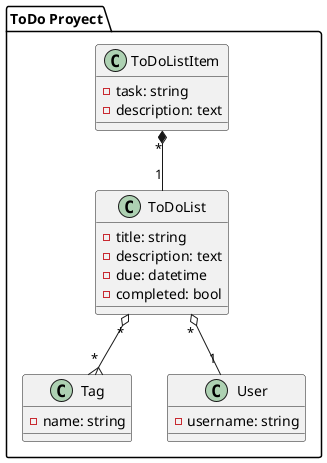
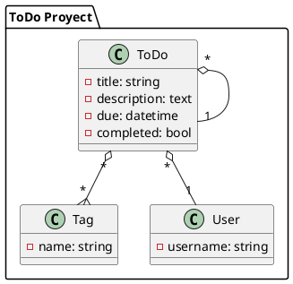

# Programming Challenge

## Resumen

Como se sugiere en el enunciado del problema es posible crear una estructura siguiendo el modelo siguiente:



Sin embargo, para hacer un uso más práctico de los ToDo, se podría desarrollar una estructura en la que los propios ToDo fuesen sub-tareas de un ToDo padre y que al mismo tiempo tengan el mismo comportamiento de un ToDo independiente. Por lo que podrían adicionar sub-tareas, completarlos, etc. La propuesta quedaría de la siguiente forma:



## Instrucciones de instalación

```shell
composer install --optimize-autoloaders

```
## Docker

```shell
docker compose up -d
```
